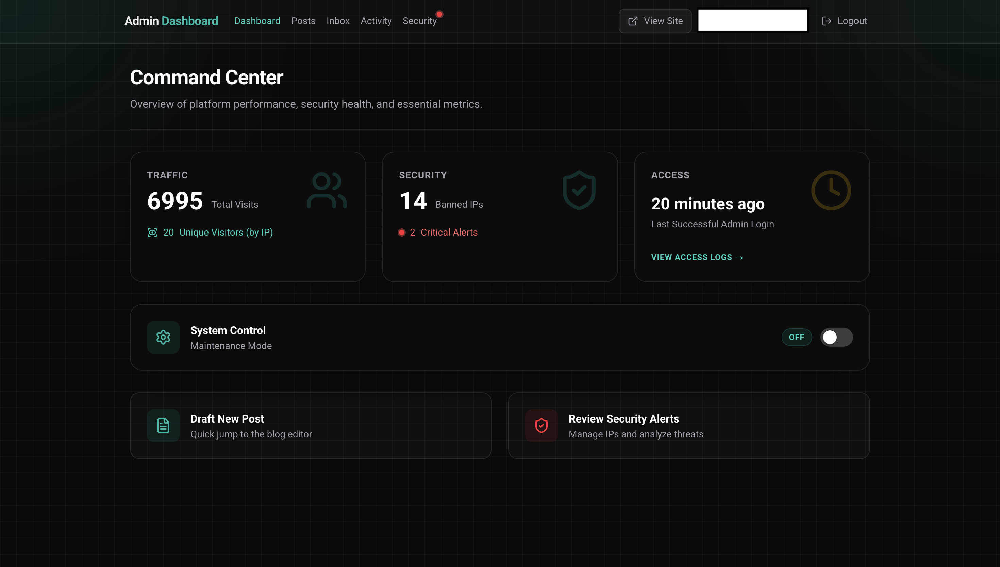
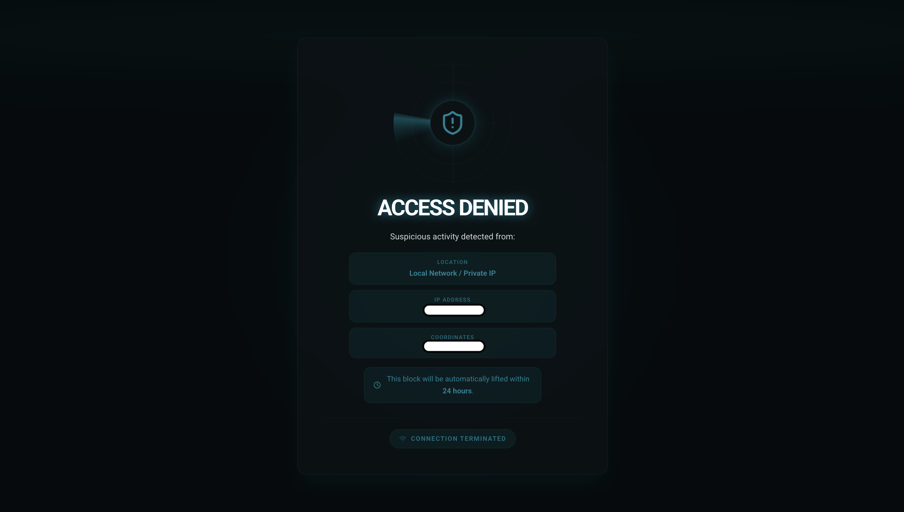

<p align="center">
  
</p>

<h1 align="center">Alfareza — Personal Portfolio & Security Research Lab</h1>

<p align="center">
  <strong>A cutting-edge personal website that fuses a professional portfolio with a production-grade security management system.</strong>
</p>

<p align="center">
  <a href="https://alfareza.site">Live Site</a> · Built with Next.js 15 &amp; Turbopack · Powered by Supabase &amp; Vercel Edge
</p>

<p align="center">
  
  
  
  
  
  
</p>

---

## 📸 Preview

<!-- Replace with actual screenshots -->
| Admin Command Center | Sentinel Banned Page |
|---|---|
|  |  |

---

## 🧭 Table of Contents

- [Overview](#-overview)
- [Security Architecture](#-security-architecture)
- [Core Features](#-core-features)
- [Tech Stack & Optimization](#-tech-stack--optimization)
- [Project Structure](#-project-structure)
- [Getting Started](#-getting-started)
- [Environment Variables](#-environment-variables)
- [Deployment](#-deployment)
- [License](#-license)

---

## 🌐 Overview

**alfareza.site** is more than a portfolio — it is a full-spectrum security research platform. The website is designed around a sophisticated **Teal-Dark theme (`#048092`)** and implements enterprise-level threat mitigation at the Edge, real-time traffic analytics, and a glassmorphic admin interface — all architected from scratch to showcase deep proficiency in modern web security and full-stack engineering.

Every request is intercepted, sanitized, and evaluated before reaching the application layer.

---

## 🛡️ Security Architecture

The project implements a multi-layered defense system that operates at the **Vercel Edge** level — before traditional server-side logic is even invoked.

### 1. Automated Strike System

A real-time IP banning mechanism that enforces a strict **5-strike policy**.

- **Brute-Force Detection**: Any IP address that accumulates 5 consecutive failed login attempts within a 10-minute window is automatically blacklisted.
- **Service Role Enforcement**: All security writes use `supabaseAdmin` with the `SUPABASE_SERVICE_ROLE_KEY`, bypassing Row Level Security (RLS) to guarantee that ban records are persisted under any condition.
- **Nuclear IP Sanitization**: Every incoming IP header undergoes rigorous sanitization — stripping IPv6 prefixes (`::ffff:`), removing trailing artifacts, and splitting forwarded chains — to prevent injection-based evasion.

### 2. Honeypot Trap

A silent, zero-interaction intrusion detection layer that catches automated scanners and malicious bots.

- **Preconfigured Bait Routes**: Common attacker probe paths (`.env`, `wp-login.php`, `phpmyadmin`, `.git/config`, `shell.php`, and 10+ others) are silently intercepted at the Edge.
- **Instant Permanent Ban**: Any request to a honeypot path triggers an immediate, permanent IP block — no warnings, no cooldowns.
- **Zero Fingerprint**: Honeypot responses are silently rewritten server-side; the attacker receives no indication that a trap was triggered.

### 3. Geopolitical Attack Origin Mapping

Intrusion attempts are enriched with real-time geolocation telemetry provided by **Vercel Edge headers**.

- **IP Geolocation**: City, country, latitude, and longitude are extracted from `x-vercel-ip-*` headers and displayed on the banned page.
- **Coordinate Display**: Precise GPS coordinates of the offending request origin are surfaced for forensic review.
- **Location-Aware Logging**: All security events are tagged with geographic metadata for pattern analysis.

### 4. Sentinel Teal — The Banned Page

Blocked visitors are rewritten to an isolated, high-security gate — a visually striking full-screen experience designed to leave an unmistakable impression.

- **Radar Scan Animation**: A custom CSS conic-gradient animation renders a rotating radar sweep within concentric ring crosshairs, centered on a pulsing `ShieldAlert` icon.
- **Dynamic Duration Logic**: The page dynamically queries the `blocked_ips` table and displays contextual messaging:
  - `expires_at === null` → **Permanent ban** (red alert UI)
  - `expires_at !== null` → **Temporary 24-hour block** (teal informational UI)
- **Total Layout Isolation**: The `/banned` route lives in its own `(banned)` Route Group with a standalone layout — completely decoupled from the main site's header, footer, and navigation shell.

---

## ⚙️ Core Features

### Admin Command Center

A unified, glassmorphic dashboard providing at-a-glance operational intelligence.

| Metric | Description |
|---|---|
| **Traffic Overview** | Total page visits + unique visitor count (deduplicated by IP) |
| **Security Health** | Active banned IPs count + critical security alert counter with live pulse indicator |
| **Last Admin Login** | Relative timestamp of the most recent successful authentication |
| **Quick Actions** | Direct links to draft new posts and review security alerts |

The dashboard features a **30-second auto-refresh** cycle for near-real-time monitoring.

### System-Wide Maintenance Mode

A professional **Kill Switch** built into the admin dashboard.

- **One-Click Toggle**: Enable or disable maintenance mode directly from the Command Center via `MaintenanceToggle`.
- **Edge-Level Enforcement**: The maintenance check runs inside the Edge proxy (`proxy.ts`), ensuring no public route can bypass it.
- **Admin Route Bypass**: Routes under `/auth`, `/admin`, `/banned`, `/maintenance`, and `/api` are whitelisted and remain accessible during lockdown.
- **Audit Trail**: Every toggle action is logged to `activity_logs` with the admin's email and timestamp.

### Dynamic Blog Engine

A performant blog system with an optimized content management workflow.

- **Post Editor**: Full-featured form with create, edit, and delete operations via Server Actions (`actions/posts.ts`).
- **Modern UI Cards**: Blog posts rendered in a responsive card grid with polished typography.
- **Markdown Rendering**: Rich content display powered by `react-markdown` with Tailwind Typography styling.

### Smart Inbox

A streamlined contact management system with operational status tracking.

- **Contact Form**: Public-facing form with Zod schema validation and Server Action submission.
- **Mark as Read**: Administrators can toggle message status with real-time badge updates.
- **Delete Capability**: Secure message removal with confirmation flow.

### GitHub Portfolio Integration

Dynamically pulls and displays repository data using the GitHub API.

- **Live Repository Feed**: Showcases public repositories with metadata via `GITHUB_TOKEN` authentication.
- **Responsive Layout**: Portfolio grid adapts seamlessly across all breakpoints.

---

## 🔧 Tech Stack & Optimization

### Core Stack

| Layer | Technology |
|---|---|
| **Framework** | Next.js 15 (Turbopack) — App Router |
| **Runtime** | React 19 with Server Components & Server Actions |
| **Language** | TypeScript 5 (strict mode) |
| **Styling** | Tailwind CSS v4 + Tailwind Typography |
| **Animations** | Framer Motion + custom CSS keyframe animations |
| **Database** | Supabase (PostgreSQL) with Row Level Security |
| **Auth** | Supabase Auth via `@supabase/ssr` |
| **Hosting** | Vercel (Edge Functions + Serverless) |
| **Icons** | Lucide React |
| **UI Primitives** | shadcn/ui · Base UI · CVA + clsx + tailwind-merge |
| **Validation** | Zod v4 |

### Performance & Architecture

- **100% Server-Side Pagination**: All log tables, security alerts, and data-heavy views implement server-side pagination to maintain **zero-lag performance** regardless of dataset size.
- **Edge-First Security**: IP blocking, honeypot detection, and maintenance mode checks execute at the **Vercel Edge** — before the request reaches the Node.js runtime.
- **Cache-Busting Fetch**: Security-critical database queries use explicit `cache: 'no-store'` and `Pragma: no-cache` headers to prevent stale Edge cache reads.
- **Route Group Architecture**: Advanced use of Next.js Route Groups for total layout isolation:
  - `(main)` — Public site + Admin panel (shared navigation shell)
  - `(banned)` — Isolated banned page (standalone layout, no inherited UI)
  - `(gate)` — Maintenance mode gate (standalone layout)
- **Timezone Consistency**: All timestamps across logs, dashboards, and security events are formatted in **WIB (Asia/Jakarta, UTC+7)** for operational consistency.

---

## 📁 Project Structure

```
src/
├── app/
│   ├── (main)/              # Primary site routes
│   │   ├── admin/           # Admin Command Center
│   │   ├── auth/            # Authentication gate
│   │   ├── blog/            # Dynamic blog engine
│   │   ├── contact/         # Smart inbox (public form)
│   │   ├── portfolio/       # GitHub portfolio showcase
│   │   ├── privacy/         # Privacy policy
│   │   ├── layout.tsx       # Shared navigation shell
│   │   └── page.tsx         # Landing / Hero page
│   ├── (banned)/            # ⛔ Isolated banned route group
│   │   └── banned/page.tsx  # Sentinel Teal radar page
│   ├── (gate)/              # 🔒 Maintenance mode gate
│   │   └── maintenance/     # Maintenance landing page
│   ├── actions/             # Server Actions (posts, contacts, logs, settings)
│   ├── layout.tsx           # Root layout (theme, fonts, metadata)
│   ├── globals.css          # Design system tokens
│   ├── robots.ts            # SEO robot directives
│   └── sitemap.ts           # Dynamic sitemap generation
├── components/
│   ├── admin/               # Admin-specific components
│   │   ├── AdminHeader.tsx
│   │   ├── AutoRefresh.tsx
│   │   ├── BlockIPButton.tsx
│   │   ├── MaintenanceToggle.tsx
│   │   ├── MarkAsReadButton.tsx
│   │   ├── PaginationControls.tsx
│   │   └── RelativeTime.tsx
│   ├── hero-section.tsx     # Landing page hero
│   ├── contact-form.tsx     # Public contact form
│   ├── github-portfolio.tsx # GitHub repo showcase
│   ├── layout-shell.tsx     # Navigation wrapper
│   └── ...                  # UI primitives & shared components
├── lib/
│   ├── supabaseAdmin.ts     # Service Role client (RLS bypass)
│   ├── security-utils.ts    # IP sanitization utilities
│   └── utils.ts             # General utility functions
├── utils/supabase/
│   ├── client.ts            # Browser Supabase client
│   ├── server.ts            # Server Supabase client
│   └── middleware.ts        # Session management middleware
├── types/index.ts           # Shared TypeScript interfaces
└── proxy.ts                 # 🛡️ Edge Proxy — the security nerve center
```

---

## 🚀 Getting Started

### Prerequisites

- **Node.js** ≥ 18.x
- **npm** ≥ 9.x
- A [Supabase](https://supabase.com) project
- A [Vercel](https://vercel.com) account (for Edge runtime features)

### Installation

```bash
# Clone the repository
git clone https://github.com/Alfareza-dev/alfareza.site.git
cd alfareza.site

# Install dependencies
npm install

# Start the development server (Turbopack)
npm run dev
```

The app will be available at `http://localhost:3000`.

### Production Build

```bash
npm run build
npm start
```

---

## 🔑 Environment Variables

Create a `.env.local` file in the project root with the following variables:

| Variable | Description | Required |
|---|---|---|
| `NEXT_PUBLIC_SUPABASE_URL` | Your Supabase project URL | ✅ |
| `NEXT_PUBLIC_SUPABASE_ANON_KEY` | Supabase anonymous/public API key | ✅ |
| `SUPABASE_SERVICE_ROLE_KEY` | Supabase Service Role key (bypasses RLS — **keep secret**) | ✅ |
| `GITHUB_TOKEN` | GitHub Personal Access Token (for portfolio data) | ✅ |
| `NEXT_PUBLIC_GITHUB_USERNAME` | GitHub username for portfolio integration | ✅ |

```bash
# .env.local
NEXT_PUBLIC_SUPABASE_URL=https://your-project.supabase.co
NEXT_PUBLIC_SUPABASE_ANON_KEY=your_anon_key
SUPABASE_SERVICE_ROLE_KEY=your_service_role_key
GITHUB_TOKEN=ghp_your_github_token
NEXT_PUBLIC_GITHUB_USERNAME=your_github_username
```

> ⚠️ **Critical**: Never commit `SUPABASE_SERVICE_ROLE_KEY` or `GITHUB_TOKEN` to version control. These keys have elevated privileges and must remain server-side only.

---

## 🚢 Deployment

This project is optimized for **Vercel** deployment. The Edge Proxy features (`proxy.ts`) require the Vercel Edge Runtime to function correctly.

1. **Connect** your GitHub repository to Vercel.
2. **Add** all environment variables from the table above to your Vercel project settings.
3. **Deploy** — Vercel will automatically detect Next.js and configure the optimal build pipeline.

> 💡 **Note**: Ensure the `SUPABASE_SERVICE_ROLE_KEY` is added to Vercel's Environment Variables under **Production**, **Preview**, and **Development** scopes for the security system to operate across all environments.

---

## 📄 License

This project is private and proprietary. All rights reserved.

---

<p align="center">
  <sub>Engineered with precision by <strong><a href="https://alfareza.site">Alfareza</a></strong></sub>
</p>
